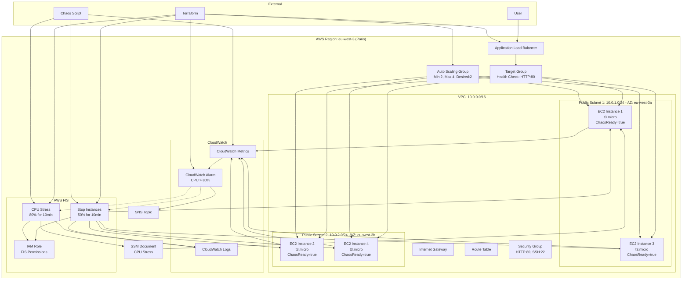

Architecture diagram
====================

```mermaid
graph TB
    subgraph "AWS Region: eu-west-3 (Paris)"
        subgraph "VPC: 10.0.0.0/16"
            subgraph "Public Subnet 1: 10.0.1.0/24 - AZ: eu-west-3a"
                EC2_1[EC2 Instance 1<br/>t3.micro<br/>ChaosReady=true]
                EC2_3[EC2 Instance 3<br/>t3.micro<br/>ChaosReady=true]
            end
            
            subgraph "Public Subnet 2: 10.0.2.0/24 - AZ: eu-west-3b"
                EC2_2[EC2 Instance 2<br/>t3.micro<br/>ChaosReady=true]
                EC2_4[EC2 Instance 4<br/>t3.micro<br/>ChaosReady=true]
            end
            
            IGW[Internet Gateway]
            RT[Route Table]
            SG[Security Group<br/>HTTP:80, SSH:22]
        end
        
        ALB[Application Load Balancer]
        TG[Target Group<br/>Health Check: HTTP:80]
        ASG[Auto Scaling Group<br/>Min:2, Max:4, Desired:2]
        
        subgraph "CloudWatch"
            CW_ALARM[CloudWatch Alarm<br/>CPU > 80%]
            CW_LOGS[CloudWatch Logs]
            CW_METRICS[CloudWatch Metrics]
        end
        
        subgraph "AWS FIS"
            FIS_ROLE[IAM Role<br/>FIS Permissions]
            FIS_EXP1[Stop Instances<br/>50% for 10min]
            FIS_EXP2[CPU Stress<br/>80% for 10min]
        end
        
        SNS[SNS Topic]
        SSM_DOC[SSM Document<br/>CPU Stress]
    end
    
    subgraph "External"
        USER[User]
        TERRAFORM[Terraform]
        SCRIPT[Chaos Script]
    end
    
    %% Infrastructure relationships
    USER --> ALB
    ALB --> TG
    TG --> EC2_1
    TG --> EC2_2
    TG --> EC2_3
    TG --> EC2_4
    
    ASG --> EC2_1
    ASG --> EC2_2
    ASG --> EC2_3
    ASG --> EC2_4
    
    %% Monitoring relationships
    EC2_1 --> CW_METRICS
    EC2_2 --> CW_METRICS
    EC2_3 --> CW_METRICS
    EC2_4 --> CW_METRICS
    
    CW_METRICS --> CW_ALARM
    CW_ALARM --> SNS
    
    %% FIS relationships
    FIS_EXP1 --> FIS_ROLE
    FIS_EXP2 --> FIS_ROLE
    
    FIS_EXP1 --> EC2_1
    FIS_EXP1 --> EC2_2
    FIS_EXP1 --> EC2_3
    FIS_EXP1 --> EC2_4
    
    FIS_EXP2 --> SSM_DOC
    SSM_DOC --> EC2_1
    
    %% Stop conditions
    CW_ALARM -.-> FIS_EXP1
    CW_ALARM -.-> FIS_EXP2
    
    FIS_EXP1 --> CW_LOGS
    FIS_EXP2 --> CW_LOGS
    
    %% Management relationships
    TERRAFORM --> ASG
    TERRAFORM --> ALB
    TERRAFORM --> FIS_EXP1
    TERRAFORM --> FIS_EXP2
    TERRAFORM --> CW_ALARM
    
    SCRIPT --> FIS_EXP1
    SCRIPT --> FIS_EXP2
    SCRIPT --> CW_METRICS
```
